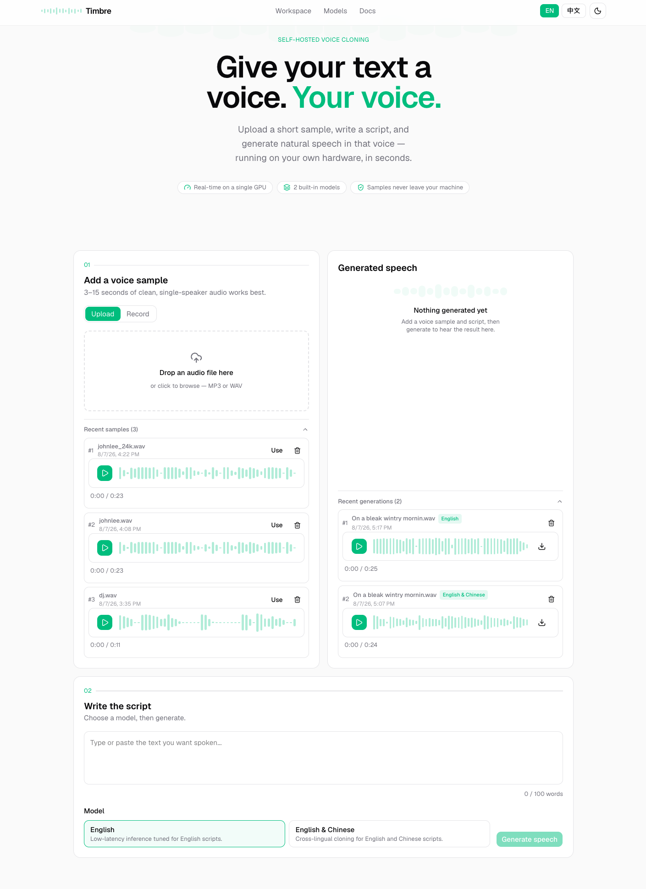

[English](./README.md) | [中文](./README.zh-CN.md)

# Timbre — TTS Inference

Text-to-speech and voice cloning, built on [CrispASR](https://github.com/CrispStrobe/CrispASR) (C++ ggml inference engine) with a Next.js web UI.

<p align="center">
  
  
</p>

## Structure

```
.
├── bin/            # crispasr binary (gitignored, fetched by setup)
├── model/          # GGUF weights (gitignored, fetched by setup)
├── scripts/        # CrispASR CLI setup + prompt text files (gitignored)
├── Makefile        # CLI recipes for local/manual generation
└── web/            # Next.js app (UI + /api/generate route)
```

## Setup

Requires the `crispasr` binary and the GGUF model files. Fetch both with:

```bash
cd web
bun run setup
```

This downloads the latest `crispasr` release binary for your platform and pulls the required models from Hugging Face into `../bin` and `../model`. Re-run any time to fill in missing files — it skips anything already present.

Models used:

| File                                 | Backend               | Purpose                 |
| ------------------------------------ | --------------------- | ----------------------- |
| `chatterbox-turbo-t3-q8_0.gguf`      | `chatterbox-turbo`    | English TTS             |
| `chatterbox-turbo-s3gen-q8_0.gguf`   | `chatterbox-turbo`    | English TTS codec       |
| `qwen3-tts-12hz-1.7b-base-q8_0.gguf` | `qwen3-tts-1.7b-base` | Multilingual TTS        |
| `ggml-base.bin`                      | `whisper`             | Reference transcription |

## Web app

```bash
cd web
bun install
bun run dev
```

- `src/app/[locale]` — App Router pages, localized via `next-intl` (`en`/`zh`)
- `src/app/api/generate/route.ts` — calls `crispasr` as a subprocess
- `src/components/landing` — hero + workspace UI
- `src/lib/tts-config.ts` — model IDs, backends, per-model input limits

The API route checks that `bin/crispasr` and the configured model files exist before spawning the process, and fails fast with a clear error (asking you to run `bun run setup`) if anything is missing.

## CLI (manual / debugging)

The root `Makefile` has recipes for driving `crispasr` directly, e.g.:

```bash
make run   # chatterbox-turbo English TTS, voice-cloned from input/dj.wav
make tr    # whisper transcription of input/johnlee.wav
```

See `Makefile` for the full set of flags each backend expects.

## Test results

### Mono English

- Chatterbox Turbo

### Multiple languages

- Qwen3 TTS

### Exploratory

- VoxCPM2 — supports text-only voice design
- Qwen3 TTS — supports voice design
